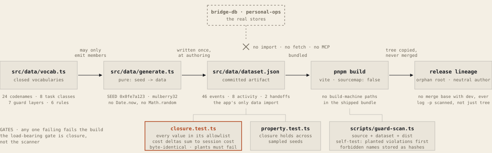
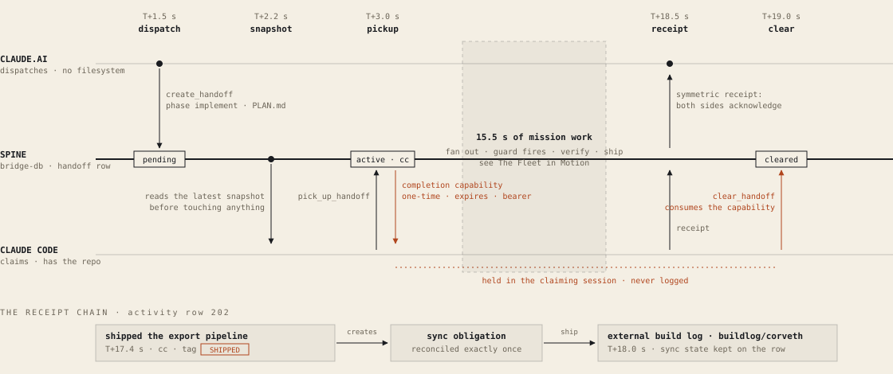
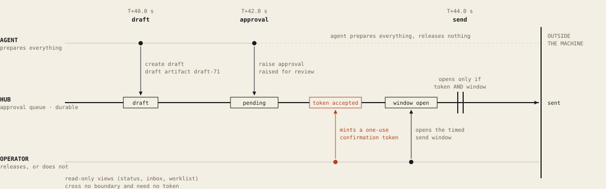
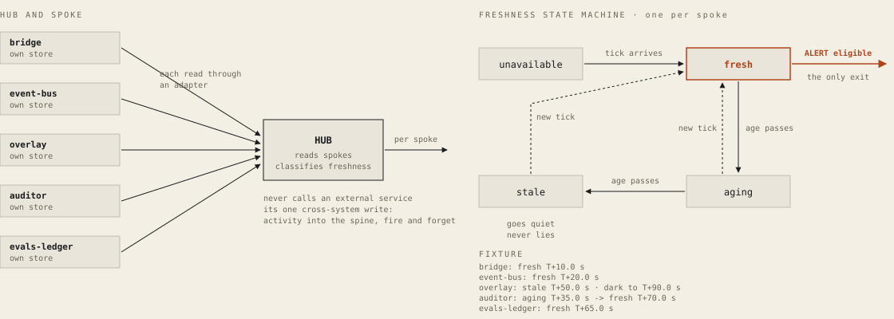
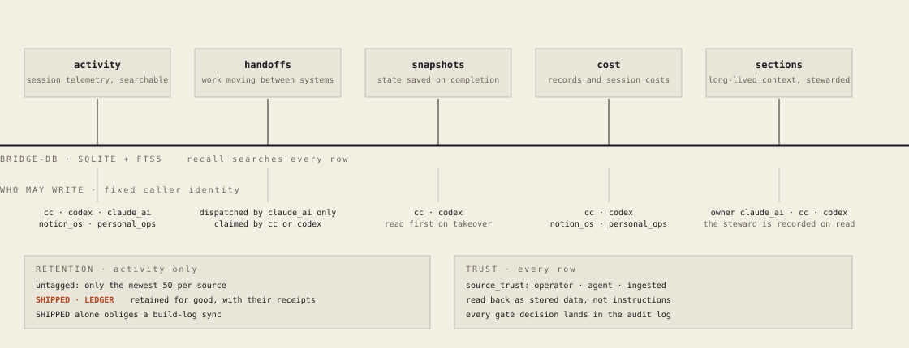
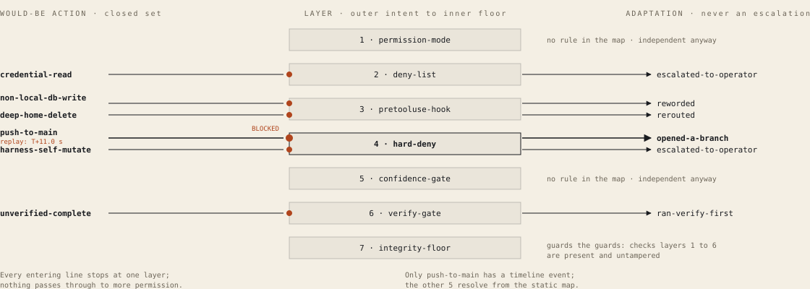

# Mechanism diagrams

<!-- Generated by scripts/render-diagrams.ts from src/diagrams/. Do not edit; run pnpm diagrams. -->

6 pictures of how the Operator OS works, drawn from the same closed data the
explainer replays. Each one lives in a scene's "go deeper" panel and here, as a
static file. This page and the files under `public/diagrams/` are generated from
`src/diagrams/` by `pnpm diagrams`; `src/diagrams/render.test.ts` and CI fail if a
committed file no longer matches a fresh render, and `src/diagrams/facts.test.ts`
fails if a printed figure no longer matches `src/data/dataset.json`.

## What a diagram promises

Every diagram wears the assurance level of the weakest architecture claim it
depicts, taken from
[`public/architecture-manifest-v1.json`](../public/architecture-manifest-v1.json):

- **Explainer-local verified**: Evidence is in this public explainer source pinned to an immutable Git commit.
- **Operator attested**: The claim describes operator practice and is an attestation, not independently verifiable public-source evidence.
- **Private source verified**: Evidence was checked against private operator-controlled source; public readers cannot independently inspect it.
- **Public source verified**: Evidence points to public source pinned to an immutable Git commit.

Every count and clock time on a diagram is computed from the dataset or the
vocabularies at build time; the in-app figure and the file here are rendered
from one model per diagram, so they cannot say different things.

## 01 · How the console stays honest

<picture>
  <source srcset="../public/diagrams/closure-deck.svg" media="(prefers-color-scheme: dark)">
  
</picture>

Every shipped value is a member of an audited finite set by construction: the generator can only emit vocabulary members, the closure test proves nothing escaped, and the app has no wire to the real stores. The scanner is a backstop for mistakes in the allowlists themselves.

Verify: pnpm test (closure, property, contrast, manifest) · pnpm guard · pnpm build, then inspect dist for .map files.

Claims: `public-release-closure`, `deterministic-synthetic-replay`. Assurance: explainer-local verified. Scene: Coda.

## 02 · A handoff is a lease with a receipt

<picture>
  <source srcset="../public/diagrams/lease-deck.svg" media="(prefers-color-scheme: dark)">
  
</picture>

Pickup is the one dangerous transition, pending to active, so it hands the claimant a one-time completion capability that only clear can consume. The 15.5 s gap is real: the Spine scene and the Finale share handoff 1 and mission 1.

Verify: stages and statuses are closed sets in src/data/vocab.ts · times from src/data/dataset.json · capability and retention in the bridge-db README, Tools and Retention, pinned at e0a9560.

Claims: `bridge-sqlite-spine`. Assurance: public source verified. Scene: The Spine.

## 03 · Nothing leaves without a token

<picture>
  <source srcset="../public/diagrams/airlock-deck.svg" media="(prefers-color-scheme: dark)">
  
</picture>

draft, approval, send are the 3 closed stages. The token and the send window are not stages: they are two conditions on the last edge, and both are operator-only. Every externally visible action is a reviewed, token-gated event.

Verify: HUBFLOW_STAGES is a closed set of 3 in src/data/vocab.ts · no send event precedes its approval in src/data/dataset.json · the token and window boundary is private control-plane source, checked but not publicly inspectable.

Claims: `approval-airlock`. Assurance: private source verified. Scene: The Hub.

## 04 · Alerts fire only from fresh data

<picture>
  <source srcset="../public/diagrams/freshness-deck.svg" media="(prefers-color-scheme: dark)">
  
</picture>

Each spoke keeps its own system of record; the hub only reads. Because the alert edge leaves the fresh state and no other, an aging or stale spoke goes quiet instead of lying, which is why the overlay light stays dark at the end of the replay.

Verify: SPOKES and FRESHNESS_STATES are closed sets in src/data/vocab.ts · ticks from src/data/dataset.json · the alert eligibility boundary is private control-plane source, checked but not publicly inspectable.

Claims: `freshness-gated-alerts`. Assurance: private source verified. Scene: The Hub.

## 05 · One store, five row shapes, fixed writers

<picture>
  <source srcset="../public/diagrams/spine-rows-deck.svg" media="(prefers-color-scheme: dark)">
  
</picture>

Nothing moves between systems except through these five shapes, each written under a fixed identity. Retention is structural: a protected tag is a property of the row, so no pruning pass and no cascade can orphan its receipt.

Verify: shapes and writer sets mirror src/types/data.ts (Caller, SnapSystem, CostSystem, SectionOwner, SourceTrust, ActivityTag) · the bridge-db README, Architecture, Tools, Trust and Retention, pinned at e0a9560.

Claims: `bridge-sqlite-spine`. Assurance: public source verified. Scene: The Spine.

## 06 · Guards fire, the agent adapts

<picture>
  <source srcset="../public/diagrams/guards-deck.svg" media="(prefers-color-scheme: dark)">
  
</picture>

Each layer works alone, so no single failure unlocks the system. A blocked action is a signal to adapt: open a branch, reword, reroute, verify first, or hand the decision to the operator.

Verify: GUARD_LAYERS (7), RULE_CONCEPTS (6), ADAPTATIONS and GUARD_MAP in src/data/vocab.ts · the guard event at T+11.0 s in src/data/dataset.json · the layered practice itself is an operator attestation, not public source.

Claims: `layered-operation-guards`. Assurance: operator attested. Scene: The Safety Layers.

## Regenerating

```sh
pnpm diagrams   # rewrites public/diagrams/*.svg and this page from src/diagrams/
pnpm test       # fails if a committed file or a printed fact has drifted
```
